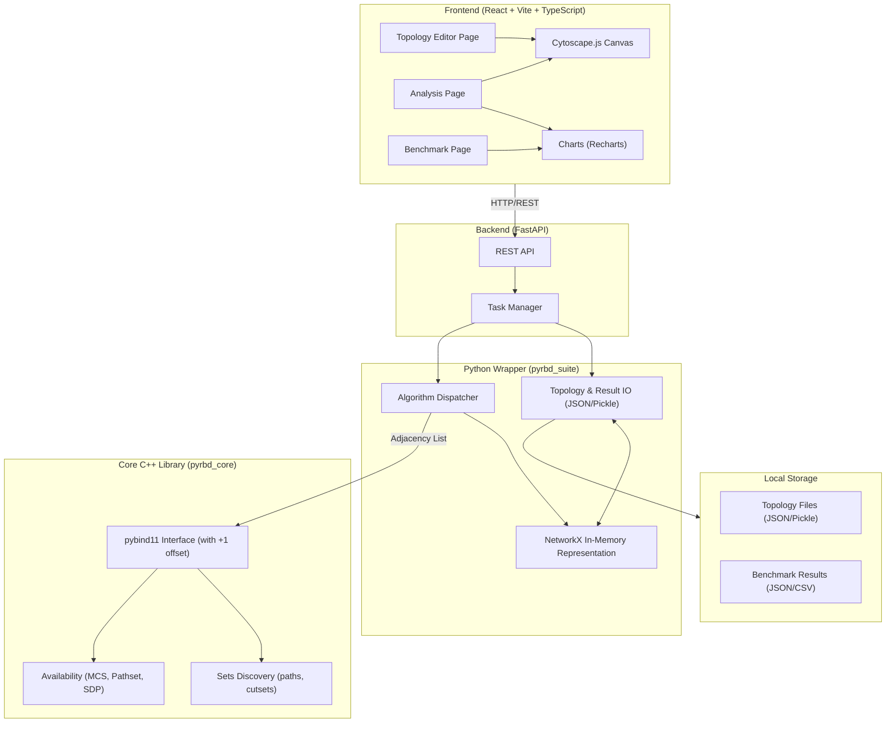

# PyRBD-Suite Web Frontend & Backend — Implementation Plan

## Problem Statement

PyRBD-Suite is a network reliability analysis library that computes **minimal cut sets**, **minimal path sets**, and **source-to-destination availability** for network topologies. The library provides multiple algorithms across two core packages (`pyrbd3`, `pyrbd_plusplus`) with C++ bindings for performance.

**Current limitations:**
- No graphical interface — users must write Python scripts to use the library
- Topology creation requires external tools or manual pickle file construction
- Results (cut sets, path sets, availability values) are text-only output
- Benchmarking requires running CLI scripts and manually analyzing CSV outputs
- No visual way to understand *which* nodes/edges form cut sets or path sets
- Architecture debt: Split codebase (`pyrbd_plusplus` vs `pyrbd3`), algorithm implementations scattered between Python and C++, and a critical `0-node` identification bug due to sign-based math.

**Goal:** Refactor the backend architecture for clarity, performance, and robustness, then build a web-based frontend that enables researchers to:
1. **Draw** and **import** network topologies visually
2. **Compute** minimal cut sets, minimal path sets, and availability with algorithm selection
3. **Visualize** results interactively on the graph with boolean expression representation
4. **Benchmark** algorithms across topologies with interactive charts and exportable results

---

## Target Users

**Researchers and academics** in network reliability and graph theory. The UI can use domain-specific terminology (MCS, pathset, SDP, availability, etc.) without simplification.

---

## System Architecture Overview

### Technology Stack

| Layer | Technology | Rationale |
|-------|-----------|-----------|
| **Frontend** | React + Vite + TypeScript | Largest ecosystem, type safety, fast dev server |
| **Graph Visualization** | Cytoscape.js (react-cytoscapejs) | Purpose-built for network graphs, supports highlighting, layouts, events |
| **Charts** | Recharts or Chart.js | Interactive charts with PNG/SVG export for publications |
| **Backend** | FastAPI (Python) | Async support, auto-generated OpenAPI docs, direct access to Python modules |
| **Python Wrapper**| pyrbd_suite | Unified Python package for topology IO, NetworkX graph prep, and algorithm dispatching |
| **Core C++ Lib** | pyrbd_core (pybind11) | Unified high-performance C++ backend for sets discovery and availability calculation |
| **Data Format** | JSON (primary) + Pickle (backward compat) | Human-readable, git-friendly, with legacy support |

### Architecture Diagram



### Project Structure (Proposed)

```
PyRBD-Suite/
├── archive/                    # Current code preserved for reference
├── packages/                   # Core Algorithm Libraries
│   ├── pyrbd_core/             # Unified C++ core (pybind11)
│   │   ├── CMakeLists.txt
│   │   └── src/
│   │       ├── include/pyrbd_core/
│   │       │   ├── common.hpp       # NodeID, Set, ProbabilityMap, makeDisjointSet
│   │       │   ├── sets.hpp         # minimalpaths, minimalcuts, AbsorbList
│   │       │   ├── availability/
│   │       │   │   ├── mcs.hpp      # MCS probaset + eval_avail
│   │       │   │   ├── pathset.hpp  # Pathset probaset + eval_avail
│   │       │   │   └── sdp.hpp      # SDP toSDPSet + eval_avail
│   │       │   └── utils.hpp        # isSubSet, hasCommonElement
│   │       ├── common.cpp
│   │       ├── sets/
│   │       │   ├── minimalpaths.cpp
│   │       │   ├── absorb_list.cpp
│   │       │   ├── cutsets_cnf_tree.cpp
│   │       │   ├── cutsets_shannon.cpp
│   │       │   ├── cutsets_multiplication.cpp
│   │       │   ├── cutsets_combination.cpp
│   │       │   └── cutsets_combination_matrix.cpp
│   │       ├── availability/
│   │       │   ├── mcs.cpp
│   │       │   ├── pathset.cpp
│   │       │   └── sdp.cpp
│   │       ├── utils.cpp
│   │       └── bindings.cpp         # Unified pybind11 + automatic 0-node offset
│   └── pyrbd_suite/            # Unified Python wrapper
│       ├── __init__.py
│       ├── io/                 # JSON/Pickle IO, Topology/Result conversions
│       ├── graph/              # NetworkX to Adjacency List, to_link_graph
│       ├── analysis/           # evaluate_availability wrapper
│       └── benchmark/          # benchmark runner logic
├── frontend/                   # React + Vite + TypeScript
│   ├── src/
│   │   ├── components/         # Reusable UI components
│   │   ├── pages/              # Page-level components
│   │   │   ├── TopologyEditor/ # Graph drawing & import/export
│   │   │   ├── Analysis/       # Computation & visualization
│   │   │   └── Benchmark/      # Benchmark suite
│   │   ├── hooks/              # Custom React hooks
│   │   ├── services/           # API client functions
│   │   ├── types/              # TypeScript type definitions
│   │   ├── styles/             # Global CSS, theme variables
│   │   └── App.tsx             # Root component with routing
│   ├── package.json
│   ├── vite.config.ts
│   └── tsconfig.json
├── backend/                    # FastAPI server
│   ├── app/
│   │   ├── main.py             # FastAPI app entry point
│   │   ├── routers/            # API route handlers
│   │   ├── models/             # Pydantic request/response models
│   │   └── tasks/              # Background task management
│   └── requirements.txt
├── topologies/                 # Topology data files (preserved)
└── README.md                   # Updated documentation
```

---

## Backend Architectural Decisions

> [!IMPORTANT]
> **Resolved 0-Node Identity Bug:** 
> The disjoint sets algorithms depend on distinguishing a node's availability state via its sign (e.g., `+5` vs `-5`). However, `0 == -0`, which breaks mathematical logic for Node 0. To resolve this without penalizing performance by rewriting core datatypes, a `+1` offset will be strictly applied in `bindings.cpp` upon passing arrays to C++, and a `-1` offset will be applied to arrays returning to Python. The core C++ algorithms will be 1-indexed exclusively, whilst users and the Python library will continue interacting seamlessly using 0-indexing.

> [!TIP]
> **Algorithm Porting & Graph Structure Interface:** 
> Sets discovery algorithms (`minimalpaths`, `minimalcuts_*`) are migrating from Python to C++. To avoid reinventing robust graph data structures, we will retain `NetworkX` in Python as the primary memory structure for topologies. The Python wrapper (`pyrbd_suite`) will extract adjacency lists from `NetworkX` and pass standard `std::vector<std::vector<int>>` objects to the C++ core (`pyrbd_core`) via pybind11. 

> [!NOTE]
> **Package Unification:** 
> Legacy dual-package structures (`pyrbd_plusplus`, `pyrbd3`) have been combined into:
> - `pyrbd_core`: Pure C++ high-performance computation.
> - `pyrbd_suite`: Python-facing API, IO processing, graph parsing, logic dispatching.

---

## Core Feature Details

### 1. Topology Editor Page
**Canvas Features:**
- Add nodes by clicking on empty canvas space
- Draw edges by dragging between nodes
- Delete nodes/edges with right-click or toolbar
- Move/reposition nodes via drag
- Zoom and pan controls
- Multiple layout algorithms (force-directed, circular, grid) via Cytoscape.js

**Node/Edge Properties:**
- Per-node availability probability (default configurable, e.g., 0.9)
- Per-edge availability probability (default configurable, e.g., 0.95)
- Node labels (auto-numbered, editable)
- Click node/edge to edit properties in a side panel

**Import/Export:**
- Import existing topologies from `topologies/` directory (pickle files)
- Save as JSON (primary) with pickle export for backward compatibility
- Topology metadata: name, description, node count, edge count

### 2. Analysis Page
**Workflow:**
1. Load a topology (from editor or imported)
2. Select source and destination nodes (click on graph or dropdown)
3. Choose algorithm(s) to run
4. View results

**Results Visualization:**
- **Table panel:** Scrollable list of all cut sets / path sets, with node IDs
- **Graph highlighting:** Clicking a set in the table highlights its nodes/edges on the graph with distinct colors
- **Boolean expression:** Show the boolean expression representation
- **Availability value:** Numeric result displayed prominently
- **Timing comparison:** Run multiple algorithms on same input, show side-by-side time comparison table

### 3. Benchmark Page
**Per-Pair Quick Benchmark:**
- Select topology + (src, dst) pair
- Run all selected algorithms
- Show comparison table with execution times

**Cross-Topology Scalability Benchmark:**
- Select multiple topologies and algorithms
- Run benchmark across all combinations
- Asynchronous execution with progress indicator

**Visualization:**
- Bar charts: grouped by algorithm, x-axis = topology, y-axis = time
- Line charts: x-axis = topology size (|V| or |E|), y-axis = time, one line per algorithm
- Interactive (hover for details, zoom, pan)
- Export as PNG/SVG for publications

---

## API Endpoints (Draft)

### Topology
| Method | Endpoint | Description |
|--------|----------|-------------|
| `GET` | `/api/topologies` | List all available topologies |
| `GET` | `/api/topologies/{name}` | Get topology data (nodes, edges, positions) |
| `POST` | `/api/topologies` | Save a new topology |
| `PUT` | `/api/topologies/{name}` | Update an existing topology |
| `DELETE` | `/api/topologies/{name}` | Delete a topology |
| `POST` | `/api/topologies/import/pickle` | Import from pickle format |

### Analysis
| Method | Endpoint | Description |
|--------|----------|-------------|
| `POST` | `/api/analysis/minimal-cut-sets` | Compute minimal cut sets for (src, dst) |
| `POST` | `/api/analysis/minimal-path-sets` | Compute minimal path sets for (src, dst) |
| `POST` | `/api/analysis/availability` | Compute availability (single pair or all pairs) |

### Benchmark
| Method | Endpoint | Description |
|--------|----------|-------------|
| `POST` | `/api/benchmark/run` | Start a benchmark task |
| `GET` | `/api/benchmark/status/{task_id}` | Check benchmark progress |
| `GET` | `/api/benchmark/results/{task_id}` | Get benchmark results |
| `GET` | `/api/benchmark/history` | List past benchmark runs |
| `GET` | `/api/benchmark/export/{task_id}` | Export results as CSV |

---

## Phased Delivery Plan

### Phase 1: Backend Architecture Refactoring & C++ Porting
**Scope:**
- **Project Restructuring**: Set up `pyrbd_core` and `pyrbd_suite` packages, archiving legacy code.
- **C++ Base Layer**: Port `common.cpp`, `utils.cpp`, `bindings.cpp` (with automatic `+1` 0-node offset).
- **Availability Engines**: Migrate existing `mcs`, `pathset`, `sdp` logic into `pyrbd_core`.
- **Public Set Dependencies**: Port `minimalpaths` (DFS) and `AbsorbList` to C++ `sets` module.
- **Sets Porting**: Iteratively port remaining `minimalcuts_*` algorithms into C++.
- **Python Suite**: Implement `pyrbd_suite.io`, `pyrbd_suite.graph` (NetworkX to Adjacency list prep), and `pyrbd_suite.analysis`.

### Phase 2: FastAPI Backend Setup & Topology CRUD
**Scope:**
- Scaffold backend app with Pydantic Models for Topologies.
- File system IO routes for Topology JSON.
- REST API for Analysis algorithms invoking `pyrbd_suite`.

### Phase 3: Foundation + Topology Editor
**Scope:**
- React frontend scaffolding with routing and sidebar navigation
- Topology Editor page:
  - Cytoscape.js canvas with node/edge creation
  - Import from existing pickle topologies
  - Save to backend JSON API
  - Node/edge property editing (labels, probabilities)
  - Layout algorithms
- Dark/light theme toggle
- Basic graph visualization

### Phase 4: Analysis & Computation
**Scope:**
- Analysis page with source/destination selection
- Algorithm selection UI (grouped by approach with paper references)
- Minimal cut set computation + visualization (table + graph highlighting + boolean expression)
- Minimal path set computation + visualization
- Availability computation (single pair, all pairs)
- Execution time display with comparison table

### Phase 5: Benchmark Suite
**Scope:**
- Benchmark page with configuration UI
- Per-pair quick benchmark
- Cross-topology scalability benchmark
- Async execution with progress indicator
- Interactive charts (bar + line) with Recharts
- Benchmark history and result reloading

---

## Verification Plan

### Automated Tests
- C++/Python API Binding Tests: Validate `0` node inputs function correctly without index issues.
- Backend: `pytest` for API endpoint testing ensuring correct algorithm selection and outputs.
- Frontend: Component tests with Vitest + React Testing Library.

### Manual Verification
- Draw a topology from scratch, save, reload — verify consistency
- Import an existing pickle topology (e.g., `Germany_17`), verify all nodes/edges render
- Compute cut sets for a known pair via the Web UI, verify against CLI output from legacy code
- Run availability comparison, verify timing display
- Run cross-topology benchmark, verify chart rendering and CSV export
